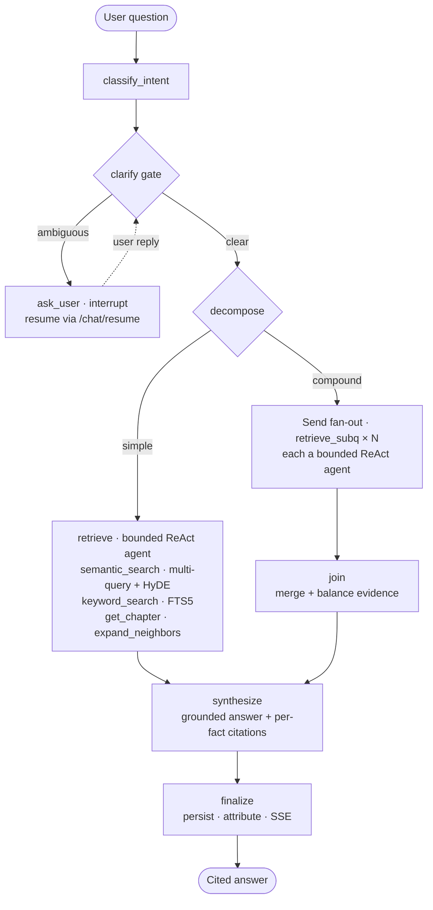

# SageSpace


An agentic reading companion. Upload an EPUB or PDF and converse with a
sage who has internalized the book: every factual claim is cited back to
the passage it came from, ambiguous questions pause for clarification,
compound questions fan out into parallel research branches, and your
reading progress reflects what you actually read through answers — not
what a retriever happened to fetch.

**Tech stack** — Agentic RAG on a **LangGraph** workflow (bounded ReAct
retrieval + plan/Send fan-out + clarify HITL), **FastAPI** backend,
**Next.js 14** frontend. Advanced retrieval: hybrid **semantic
(ChromaDB) + keyword (SQLite FTS5)** search, **RAPTOR** summary tree,
**HyDE** + multi-query, **SqliteSaver** checkpoints, **LangSmith**
tracing, **OpenRouter** model gateway.

> Built as the course project for the Turing College **AI Engineer**
> program.


| | |
|---|---|
|  |  |
| _Chat with per-fact citations_ | _Open a citation to verify the source_ |
|  | |
| _Reading Map — cited passages light up per chapter_ | |

---

## 1. The problem

Studying a book with an AI assistant fails in three ways:

1. **Trust** — assistants answer fluently from training memory, with no
   way to tell a grounded answer from a hallucination. An uncited
   answer is worthless to someone studying the text.
2. **Coverage** — one vector search can't serve every question:
   "summarize chapter 7" needs structural lookup, "compare the Queen
   and the Cat" needs multiple searches, "who said X" needs exact
   keyword match. A fixed RAG pipeline picks one strategy and fails on
   the rest.
3. **Continuity** — assistants forget what you asked, what you've
   covered, and who you are.

For readers who want to interrogate a text rather than skim it.

## 2. What the agent does

- **Ingest** an EPUB/PDF (≤ 50 MB) into a canonical text layer
  (sections + blocks with positional anchors), retrieval chunks, a
  RAPTOR summary tree (one summary per chapter, themed clusters above),
  and an FTS5 keyword index.
- **Converse** through a bounded agentic LangGraph workflow: intent
  classification → human-in-the-loop clarification → question
  decomposition with parallel fan-out → a ReAct retrieval agent
  choosing among four tools → grounded synthesis → finalization.
- **Cite** every `<fact>` in the answer. A batched LLM mapper routes
  each fact to the chunk(s) that support it (or to a chapter summary,
  clearly labeled); a deterministic quote guard verifies verbatim
  quotes; unattributable facts get *no* citation rather than a fake one.
- **Track what you've read.** The shelf %, the session panel, and the
  Reading Map all count **cited** passages — what answers actually
  showed you — with the Reading Map lighting chunks per section.
- **Remember.** Conversations persist per book (reopen/delete from the
  history sidebar); explicitly stated user facts are silently captured
  to long-term memory; a recommendations panel suggests next reads
  validated against the Google Books API.

### Example session

| You ask | What happens |
|---|---|
| *"What's chapter 6 about?"* | Deterministic chapter lookup → level-1 RAPTOR summary + the chapter's own chunks |
| *"Why does the Queen of Hearts want to behead people?"* | ReAct agent mixes semantic + keyword search, answer arrives with per-fact citation icons |
| *"Compare chapter 1 and chapter 12 in a table"* | Decomposed into sub-questions, researched in parallel branches, merged into one cited Markdown table |
| *"What happened to him afterwards?"* (ambiguous) | The turn **pauses** and asks which character you mean; your answer resumes the same turn |
| *"How much have I read?"* | Deterministic progress tool — cited passages / total, zero hallucination surface |
| *"Save my notes as PDF"* | Conversation exported as a formatted file |
| *"Call me XXX"* | Captured to long-term memory (no extra LLM call — it rides the intent classifier) |

## 3. Quick start

### Prerequisites

- Python 3.12+, Node.js 18+
- An [OpenRouter](https://openrouter.ai) API key (unified gateway for
  the chat + embedding models used here)

### Backend

```bash
cd sagespace/backend
python -m venv venv
source venv/bin/activate          # Windows: venv\Scripts\activate
pip install -r requirements.txt
cp .env.example .env              # fill in OPENROUTER_API_KEY
uvicorn main:app --reload --host 0.0.0.0 --port 8000
```

### Frontend

```bash
cd sagespace/frontend
npm install
cp .env.local.example .env.local
npm run dev                       # http://localhost:3000
```

### Environment variables

Backend `.env` (see `.env.example` for full notes):

| Variable | Required | Purpose |
|---|---|---|
| `OPENROUTER_API_KEY` | yes | Auth for all chat + embedding model calls |
| `OPENROUTER_BASE_URL` | no | Gateway override (default `https://openrouter.ai/api/v1`) |
| `GOOGLE_BOOKS_API_KEY` | no | Recommendation metadata; without it recs degrade gracefully (anonymous quota 429s) |
| `LANGCHAIN_TRACING_V2` + `LANGCHAIN_API_KEY` / `_PROJECT` / `_ENDPOINT` | no | LangSmith tracing of every chat-turn graph run (EU accounts must set the EU endpoint) |
| `MODEL_PRICING_PATH` | no | Pricing table for token-cost accounting |

Frontend `.env.local`: `NEXT_PUBLIC_API_URL` (default `http://localhost:8000`).

## 4. Architecture

### The chat turn — a bounded agentic LangGraph workflow



Node detail the diagram leaves out: `classify_intent` is one
structured (JSON-schema) gpt-4o-mini call that also flags ambiguity
and captures memory notes; the clarify interrupt has a 30-minute TTL
that safe-degrades to a broad answer; `synthesize` is a gpt-5.4-mini
sage-persona call emitting `<fact>`/`<commentary>` tags, immediately
followed by the batched attribution mapper.

State flows through a typed `GraphState` (LangGraph `StateGraph`);
every turn is checkpointed by a **SqliteSaver** with
`thread_id = session_id`, which is what makes the interrupt/resume
seam and session reopening durable. The turn's working `history` is a
sliding window (last 20 messages) into that state — the full
conversation persists in `sessions.conversation_json` for sidebar
restore. Checkpoints are garbage-collected when their session or book
is deleted, and each thread is bounded to its last 30 checkpoints
after every turn, so neither growing histories nor long sessions can
bloat the checkpoint DB without bound.

### The ReAct retrieval agent (function calling)

The `retrieve` step is a bounded ReAct subgraph: an LLM with four
**function-calling tools** bound to it, looping `agent → tools → agent`
until it has enough evidence (hard cap: 5 iterations, plus a semantic
safety net so a turn never returns empty-handed):

| Tool | What it does | When the agent picks it |
|---|---|---|
| `semantic_search` | Multi-query + HyDE vector search over ChromaDB | Conceptual / "why" questions |
| `keyword_search` | SQLite FTS5 over the canonical block layer | Exact names, phrases, quotes |
| `get_chapter` | Structural lookup: level-1 summary + relevance/stride-sampled chunks | "What happens in chapter N" |
| `expand_neighbors` | Fetch adjacent chunks around a hit | A hit that needs surrounding context |

Tool calls stream to the UI as live activity ("Searching by keyword…")
and are fully visible in LangSmith traces.

### Three agent patterns in one app

Three agent architectures, each where it fits: the chat turn is a
**fixed graph** where each node has one job (predictable cost,
debuggable); retrieval inside it is a **bounded ReAct agent** (dynamic
tool choice where flexibility pays); compound questions use
**plan-and-execute fan-out** (decompose once, run branches in
parallel, synthesize once). The agent decides routing; synthesis
always runs the same grounded prompt.

### Why an agent (and not just prompt engineering or plain RAG)?

- **Prompt engineering alone** cannot answer book questions truthfully
  — the model will answer famous books from training memory. Grounding
  requires retrieval.
- **Plain RAG** (one vector search → synthesize) fails on structural
  questions ("chapter 7"), exact-phrase questions, and compound
  questions — each needs a different access path into the book.
- **An agent** chooses the access path per question. The agentic
  retriever lifted recall from 38% → 96% on the project's offline
  benchmark versus the fixed pipeline it replaced (see §8).

The flip side — agents cost more and can wander — is handled by
bounding: iteration caps, conservative decomposition (≤4 branches),
and deterministic paths (chapter lookup, progress, export) that skip
the agent entirely when the intent is unambiguous.

### Knowledge base (the RAG substrate)

- **Canonical layer (SQLite)** — the source of truth. EPUB/PDF
  normalizers produce `sections` (with `kind` — chapter / front matter
  / appendix … — and `printed_number`, so "chapter 5" means the
  author's chapter 5) and `blocks` (paragraphs with locators). EPUB TOC
  resolution is anchor-aware, surviving Gutenberg-style books that pack
  a whole book into a few files.
- **Chunks + RAPTOR (ChromaDB)** — 800-char retrieval chunks with
  block back-references; level-1 = one summary per chapter
  (structurally derived, not clustered), KMeans-themed levels above.
- **FTS5 keyword index** — `blocks_fts`, powering `keyword_search`.
- **Two ledgers** — `retrieved_chunks` (internal: what fed the
  synthesizer) and `cited_chunks` (user-facing: what answers cited);
  all visible progress speaks the *cited* semantic.

### Citations you can audit

The synthesizer wraps claims in `<fact>` tags. A single batched
gpt-4o-mini call maps each fact to the passages that support it
(numbered-passage output, validated server-side, ≤2 per fact, empty
allowed). RAPTOR chapter summaries are legitimate targets and the
popup labels them *"AI-generated chapter summary — not the book's own
words"*. A deterministic quote guard enforces that verbatim quotes are
only attributed to text that contains them. The popup shows the full
source text, section + page, and the chunk id — no decorative
highlighting that would imply more precision than the system has.

### Memory

- **Short-term**: conversation history per session (SQLite) + LangGraph
  checkpoints per thread; the session-history sidebar lists, reopens,
  and deletes past conversations (deleting a chat never un-reads the
  book — progress ledgers survive).
- **Long-term**: a fast-lane memory — `classify_intent` flags
  explicitly stated user facts ("call me XXX") at zero extra LLM
  cost; `finalize` persists them only for committed turns. Notes are
  managed at `/api/memory-notes` and feed the recommendation engine,
  which proposes Google-Books-validated next reads with an
  add / dismiss / save lifecycle.

### Observability & cost

- **LangSmith** (optional, env-gated) traces every turn: intent,
  clarify, each retrieval tool call, synthesis, finalize.
- **Token accounting**: one usage callback per request accumulates all
  LLM calls of a turn; the Insight panel shows tokens and humanized
  cost per conversation (pricing table in `config/model_pricing.json`).

## 5. REST API

All routes under `/api` (FastAPI; interactive docs at `/docs`).

| Area | Routes |
|---|---|
| Books | `GET /books` · `GET /books/{id}` · `GET /books/{id}/content` · `GET /books/{id}/cover` · `DELETE /books/{id}` · `POST /ingest` |
| Chat | `POST /chat/session` · `GET /chat/session/{id}` · `GET /chat/sessions/{book_id}` (history) · `DELETE /chat/session/{id}` · `POST /chat` (SSE) · `POST /chat/resume` (clarify HITL) |
| Canonical | `GET /books/{id}/sections` · `…/blocks` · `…/blocks/{block_id}` · `…/ingestion-report` · `…/citations/{chunk_or_node_id}` |
| Progress & export | `GET /progress/{book_id}?session_id=` · `POST /export` |
| Memory | `GET /memory-notes` · `PATCH /memory-notes/{id}` · `DELETE /memory-notes/{id}` |
| Recommendations | `GET /recommendations` · `GET …/saved` · `POST …/refresh` · `POST …/{id}/add` · `…/{id}/dismiss` · `…/{id}/unsave` · `GET …/stats` |
| Debug (powers Reading Map + offline eval) | `GET /debug/books/{id}/chunk-map` · `GET /debug/sessions/{id}/retrieval-events` · `GET /debug/retrieval-events/{id}` · `GET /debug/books/{id}/chunks/{chunk_id}/full` |
| Health | `GET /health` |

## 6. Error handling & edge cases

Designed so that **an LLM failure degrades the answer, never the turn**:

- Empty retrieval → explicit refusal prompt, not hallucinated synthesis.
- Attribution-mapper failure (call error, malformed JSON, wrong shape)
  → facts render without citation icons; the answer still ships.
- Malformed model output: nested/unclosed `<fact>` tags are flattened
  and balanced deterministically; doubled answers are de-duplicated.
- Clarify interrupt older than 30 min → resume safe-degrades to a
  broad answer with a visible notice instead of failing.
- Ingestion errors land the book in an `error:` status visible on the
  shelf; uploads are capped (50 MB, `.pdf`/`.epub` only) and stored
  under server-generated UUID names.
- User-supplied title/author are stripped of control characters and
  capped at 200 chars; the upload-filename fallback is URL-decoded
  first, so percent-encoded NULs (`%00%00.epub`) can't slip past the
  cleaning.
- Google Books quota exhaustion (429) → recommendations degrade
  (no blurbs) instead of blanking the panel.
- Legacy (pre-canonical) books answer `409` on citation resolution and
  the UI explains rather than crashes.
- The offline test suite (535 tests) runs with **no API key and no
  network** — every LLM/Chroma boundary is mockable and the degradation
  paths above are regression-tested.

## 7. Logs & observability

Backend logs are emitted as one JSON object per line to stdout, every
line tagged with the request id minted at the middleware layer:

```json
{"time": "2026-06-17T13:45:29.715Z", "level": "INFO",
 "logger": "api.chat", "msg": "chat_turn_received",
 "request_id": "96f1...", "session_id": "750b...", "book_id": "e239..."}
```

The request id is echoed in the response's `X-Request-ID` header, so
a user-reported issue is traceable end to end: the failing curl
returns an id, you grep the logs, and you click into LangSmith for
the LLM-call detail under the same time window.

A useful dev setup:

```bash
./venv/bin/uvicorn main:app --reload --port 8000 --no-access-log 2>&1 \
    | tee sagespace.log
```

`--no-access-log` silences uvicorn's plain-text access lines (our
middleware logs `request_start` / `request_end` with more detail).
Then in another terminal:

```bash
tail -f sagespace.log | jq .                                       # live
grep '"request_id":"abc123"' sagespace.log | jq .                  # by id
jq 'select(.session_id == "<sid>")' sagespace.log                  # by session
jq 'select(.msg == "request_end" and .took_ms > 1000)' sagespace.log  # slow
jq 'select(.level == "ERROR" or .level == "WARNING")' sagespace.log
```

Structured logs and LangSmith are complementary — LangSmith captures
full prompt / response / token detail for every LLM call (when
enabled); these logs capture everything else (HTTP lifecycle, caught
exceptions, deterministic-node decisions, system events) and remain
useful when LangSmith is off.

## 8. Security considerations

- All model/API keys live server-side in `.env` (git-ignored, with a
  documented `.env.example`); the browser never sees them.
- SQL access is parameterized throughout; uploaded files are renamed to
  UUIDs and size/type-validated before processing.
- **Prompt-injection resistant**: book content is treated as data, not
  instructions — synthesis prompts constrain the model to the retrieved
  CONTEXT, and the attribution mapper only ever outputs validated
  passage *numbers*, so a malicious document cannot inject chunk ids or
  URLs into the citation system.
- This is a single-user local app — no authentication or rate limiting.
  Multi-user deployment would need auth, per-user data partitioning,
  and upload scanning first.

## 9. Evaluation

Quality is measured by **sage-eval**, a companion offline benchmark:
it drives the real `/api/chat` SSE endpoint as a black box over a
24-question Alice testset and scores 8
dimensions — Recall@8 / Precision@8 / MRR@8 (retrieval), Faithfulness
(RAGAs-style two-step LLM judge), Completeness, Refusal correctness,
plus cost & latency.

The headline move is what the agentic redesign bought over the fixed
4-node pipeline it replaced (3-run averages):

| Metric | Fixed pipeline | Agentic workflow |
|---|---|---|
| Recall@8 | 38% | **96%** |
| Completeness (design lens) | — | **88%** |
| Faithfulness | — | **100%** |
| Refusal correctness | — | **100%** |

An earlier *online* faithfulness probe (a yes/no self-check per turn)
reported ~100% regardless of grounding, so I retired it and built the
offline harness instead — a self-graded prompt is not a measurement.

## 10. Running tests

```bash
cd sagespace/backend
source venv/bin/activate
python -m pytest tests/ -q        # 535 passed, 1 skipped — offline, no API key
```

Key surfaces: graph wiring & fan-out (`test_graph_pipeline`,
`test_pipeline_plan`), clarify HITL (`test_graph_clarify`,
`test_chat_resume`), ReAct agent & tools (`test_retrieve_agent`,
`test_retrieval_tools`, `test_keyword_search`), attribution & quote
guard (`test_chat_attribution`, `test_finalize`), canonical ingestion
(`test_canonical_*`, `test_chapter_parse`), RAPTOR (`test_raptor`),
session history (`test_session_history_api`), memory & recommendations
(`test_memory_*`, `test_recommend*`).

## 11. Known limitations & future work

- **Eval is on a famous text.** The numbers above are measured on
  *Alice* — which the models partly know from training — and on EPUB
  ingestion only. PDF ingestion works (its own normalizer + unit
  tests) but hasn't been run through the eval harness, so expect
  rough edges on real-world PDFs. A non-famous-book testset would
  stress faithfulness harder.
- **Retrieval gaps for iconic lines**: a chapter's most famous
  sentence sometimes only enters context via the chapter summary; the
  citation system handles this honestly (labeled summary citations),
  but retrieval itself could rank verbatim-quote chunks higher.
- **FTS5 + CJK**: the `unicode61` tokenizer does not segment Chinese /
  Japanese / Korean, so the keyword leg is a no-op for CJK books
  (semantic search is unaffected). Switch to a trigram/ICU tokenizer
  when needed.
- **Cost-confirm HITL is deferred**: at current per-turn cost (cents) a
  confirmation dialog is friction, not safety. The interrupt/resume
  seam is already in place to add it when expensive tools (web search)
  land.
- **Per-fact attribution accuracy is not yet a scored eval dimension**
  — the mapper is unit- and live-tested, but a dedicated scorer would
  close the loop.

## 12. Repository layout

```
sagespace/
├── backend/    FastAPI + LangGraph workflow (core/graph), node pipeline
│               (core/pipeline), canonical EPUB/PDF layer + RAPTOR index,
│               535-test offline suite
├── frontend/   Next.js 14 App Router — shelf, chat, reading map, dashboard
├── inspect/    Read-only Streamlit viewer for the canonical layer (dev tool)
└── docs/       memory-MVP design, data-lifecycle notes
```

## License & attribution

This project is released under the [MIT License](LICENSE).

Test books are public-domain texts from Project Gutenberg (*Alice's
Adventures in Wonderland*, *The Art of War*, *The Handbook of Soap
Manufacture*).
