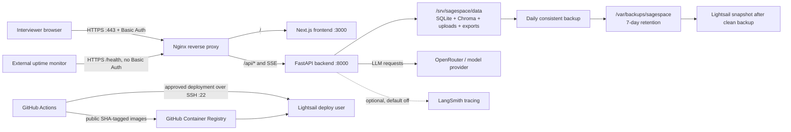

# SageSpace Production Deployment and Career Evidence Plan

- **Status:** Approved for execution
- **Approved:** 2026-08-17
- **Canonical scope:** Production deployment, operations, learning evidence, and portfolio packaging
- **Progress system:** [GitHub parent issue #1](https://github.com/dontknowhow2namemzself/SageSpace/issues/1) plus milestone child issues

This document is the canonical deployment plan for SageSpace. Earlier external
plans are historical input only. GitHub Issues will become the canonical source
for execution status; this document defines the goal, boundaries, milestone
gates, and accepted engineering decisions.

## 1. Objective

Deploy SageSpace as a secure, intentionally small production system and use the
work to demonstrate readiness for German and European roles such as:

> Applied AI / LLM Engineer with production ownership

The project must prove more than the ability to call an LLM API. It should show
that the owner can take an AI product from source code to production, explain
the architecture, control cost and data exposure, operate it, recover it, and
make defensible trade-offs.

Learning depth takes priority over a launch deadline. The project owner will
personally execute the important commands, including repetitive configuration
where repetition improves understanding. AI may assist with planning, drafts,
and review; the owner remains responsible for decisions, verification,
deployment, troubleshooting, and final ownership.

## 2. Job-market calibration

The plan was calibrated against a 2026-08 snapshot of roles available in
Germany or Europe. Openings change, so these links are evidence of the market
signal at planning time rather than a permanent list of targets.

| Role | Relevant signal |
| --- | --- |
| [LI.FI — Applied AI Engineer](https://jobs.ashbyhq.com/li.fi/5f0b1f78-25c7-492c-aecf-e80d631623b2/) | Entry-level trajectory, public work, end-to-end ownership, DevOps, security, Docker, and AWS |
| [Nelly — Junior AI Engineer](https://jobs.ashbyhq.com/nelly/0cce75d3-e959-4db1-bba0-2a1b30845d53/) | Python, agents, AWS, compliance, and prototype-to-production delivery |
| [BoWatt — Applied AI Engineer](https://jobs.ashbyhq.com/bowatt/e6a64c99-477b-40a7-bd84-1f0c5cde942b) | LLM integration, vector databases, production deployment, privacy, and data hygiene |
| [Integral — Senior AI Engineer](https://jobs.ashbyhq.com/integral-de/691b437e-3385-4705-a057-a3fed9a3970d) | Agent systems, quality control, performance, cost, and reliability |
| [Delvo — AI Engineer, Applied LLMs, Workflows & Evals](https://jobs.ashbyhq.com/delvo/0b8f4f50-c963-49f6-b2a6-d29a280d1ec4) | RAG, tool use, retries, graceful degradation, tracing, and regression evaluation |
| [JUPUS — Senior Applied AI Engineer](https://jobs.ashbyhq.com/jupus/92089cad-3bd4-4761-9518-a8cc0c2d3435/) | RAG, agents, Python, observability, evaluation, and production reliability |
| [Cosuno — Senior AI Engineer](https://jobs.ashbyhq.com/cosuno/97016567-a187-4505-80e8-df6a5fee7da2) | Retrieval, agents, offline evaluation, A/B testing, and full lifecycle ownership |
| [Enpal — AI Platform Engineer](https://jobs.ashbyhq.com/enpal/208c7c58-f0db-4c37-942a-aad765b1c539) | Backend platforms, tracing, evaluation, CI/CD, determinism, and reliability |
| [Bonsai Labs — Senior Applied AI Engineer](https://bonsai-labs.com/careers/senior-applied-ai-engineer) | Cloud deployment, monitoring, evaluation, and stakeholder communication |
| [Cortea — Software Engineer, Data & AI Platform](https://jobs.ashbyhq.com/cortea/971b9f39-3b65-4687-8bc8-243b9924d468) | Production agents, data foundations, evaluation, and observability |

### Evidence matrix

| Common requirement | Existing SageSpace evidence | Gap this plan must close |
| --- | --- | --- |
| End-to-end delivery | Working full-stack AI application | Deploy, operate, recover, and document it |
| RAG and agent depth | Hybrid retrieval, LangGraph workflow, citations, and bounded tools | Preserve the technical core and prove it under production constraints |
| Evaluation | README reports a 24-question, eight-metric offline benchmark | Make the benchmark inputs, commands, versions, and results reproducible |
| Observability | Structured logs and optional LangSmith integration | Add production correlation, alerts, runbooks, and incident evidence |
| Reliability | Existing error handling and offline tests | Add durable ingestion state, graceful failure, deployment gates, and rollback |
| Cloud and delivery | No verified production deployment yet | Add Docker, AWS, HTTPS, CI/CD, and health verification |
| Security and data boundaries | Upload validation and prompt-injection defenses | Add access control, secret boundaries, retention, and a threat model |
| Cost and latency judgment | Token and price accounting exist | Add a hard budget, profiling, production measurements, and friendly exhaustion |
| Communication | Strong technical README narrative | Add decision records, trade-offs, teach-backs, and interview-ready evidence |

The research is a calibration tool, not a keyword checklist. Kubernetes and
Terraform appear in some roles, but are not required to prove the first
production-ownership loop. A well-operated simple architecture is more valuable
at this stage than an unneeded distributed platform.

## 3. Current baseline

At plan approval:

- `main` contains one committed application baseline.
- A set of uncommitted Phase 1 changes partially externalizes mutable paths,
  CORS, application URL configuration, request limits, relative frontend API
  routing, and Next.js standalone output.
- Those changes have passed static syntax checks, but not a restored full test,
  frontend build, or end-to-end environment.
- Containerization, cloud infrastructure, HTTPS, operations, and CI/CD have not
  started.
- The README describes an offline `sage-eval` benchmark, but the current
  repository does not contain a publicly reproducible companion harness.

The existing uncommitted work must be preserved, reviewed, tested, and split
into focused commits. It must not be trusted or committed as one opaque batch.

## 4. Accepted production boundary

Version 1 is a portfolio-grade, single-instance production deployment:

- AWS Lightsail in Frankfurt (`eu-central-1`)
- Ubuntu 24.04
- Docker Compose
- Nginx and Certbot as Compose services
- DuckDNS hostname; no purchased personal domain yet
- HTTPS and whole-site Basic Auth
- Minimal unauthenticated `/health`
- One Uvicorn worker and at most one ingestion job
- Local persistent storage on one server
- Short planned maintenance windows are acceptable
- No claim of high availability, zero downtime, multi-tenancy, or SaaS scale

This boundary is deliberate. The public documentation must explain why it is
sufficient for a controlled interview demo and what would need to change for a
real multi-user service.

### Explicit non-goals for version 1

- Kubernetes
- Terraform
- Prometheus/Grafana
- Redis/Celery
- Multi-region deployment or load balancing
- Multi-user accounts and tenant isolation
- Cross-cloud backups
- Zero-downtime deployment
- GitHub OIDC-controlled dynamic SSH firewall rules
- A personal domain

## 5. Target architecture



Only ports 22, 80, and 443 are exposed publicly. Ports 3000 and 8000 remain
inside the Docker network. During the first manual deployment, SSH is restricted
to the owner's current public IP. The first CI/CD version may expose port 22 to
the internet, but only with key authentication, a dedicated deployment user,
root/password login disabled, and monitoring.

### Server filesystem

| Path | Purpose |
| --- | --- |
| `/opt/sagespace/` | Compose files, deployment configuration, and operational scripts |
| `/srv/sagespace/data/` | SQLite databases, Chroma data, uploads, exports, and application state |
| `/var/backups/sagespace/` | Consistent backups with seven-day retention |

Production uses bind mounts so an operator can inspect, back up, restore, and
reason about the exact host paths.

## 6. Security and data decisions

### Authentication and network

- The demo username is `demo`; its strong random password is shared one-to-one
  and rotated for each recruiting cycle.
- The password never appears in the repository, README, screenshots, or video.
- HTTP port 80 serves ACME challenges and redirects normal traffic to HTTPS.
- `/health` is the only intentionally unauthenticated application path and
  returns only `ok` or `unavailable`.
- The backend performs a lightweight SQLite readiness query; health checks do
  not call an external paid service.

### Host and container hardening

- SSH is key-only; root and password logins are disabled.
- A non-root `deploy` user operates the application.
- Application containers run as non-root users.
- Containers are not privileged and do not mount the Docker socket.
- Images, dependencies, GitHub Actions, and Git history are scanned.
- Unresolved critical/high findings block deployment unless a documented risk
  acceptance explains scope, mitigation, owner, and expiry.

### Secret boundaries

- Local and production `.env` files never enter Git, images, logs, or artifacts.
- Development and production OpenRouter keys are separate.
- The production OpenRouter key exists only on the server.
- GitHub's `production` Environment stores the deployment SSH private key and
  requires approval before the deployment job can read it.
- Personal administrator SSH and GitHub Actions deployment SSH use separate key
  pairs.
- The server pulls public GHCR images and therefore does not store a GitHub PAT.
- The DuckDNS token stays in a password manager.
- TLS private keys and the Basic Auth password hash remain server-side.
- AWS Secrets Manager is deferred until the number of secrets, operators, or
  compliance requirements makes centralized rotation worthwhile.

### Data handling

- The seeded demo library contains two or three public-domain books.
- Users are warned not to upload confidential, personal-sensitive, or
  unauthorized copyrighted material.
- Interview data is deleted within seven days or immediately on request.
- Backups are retained for seven days.
- Logs do not contain full books, full chat transcripts, or secrets.
- The public documentation states that AI requests pass through third-party
  model services.
- LangSmith tracing is environment-controlled and disabled by default. If
  enabled, only controlled public-domain test data is used.
- Documentation describes implemented controls without claiming audited GDPR
  compliance.

### Cost protection

- Use a dedicated production OpenRouter key with a USD 10 monthly hard limit.
- Basic Auth, request limits, token/cost limits, and friendly exhaustion prevent
  an unexpected bill and make failure understandable to the user.

## 7. Reliability decisions

### Ingestion

FastAPI in-process background tasks are not durable: a restart, deployment, or
out-of-memory event can terminate indexing and leave a book permanently marked
as building. Version 1 will use an intermediate design without Redis/Celery:

- At most one ingestion job may run.
- SQLite stores queued/building/interrupted/error/ready status.
- Startup detects stale `building` work and marks it `interrupted`.
- An interrupted job can retry from the retained upload.
- Deployment refuses to start while indexing is active.
- The UI exposes queued, building, interrupted, error, and ready states.

The future scale path is an external queue and separate worker pool, but it is
not needed for the controlled single-instance demo.

### Recovery objectives

- Recovery point objective (RPO): 24 hours
- Recovery time objective (RTO): 2 hours
- Daily application-consistent backups
- Seven-day retention
- Lightsail snapshot only after a clean application backup
- A real restore drill, not only a backup-exists check

### Release and rollback

- Release images are tagged with the Git commit SHA.
- The current and previous application versions are retained.
- Deployments avoid ingestion and interview windows.
- Health and smoke checks follow every deployment.
- A failed release rolls back to the previous compatible image.
- Schema changes remain backward compatible across the rollback window.
- The project includes a deliberate failed-deployment drill.

## 8. Milestones

### M0 — Take over existing work and recover the overview

**Purpose:** establish a trusted baseline without losing or blindly accepting
the existing uncommitted changes.

**Work:**

1. Create `codex/deployment-foundation`.
2. Capture and explain the current diff before modifying it.
3. Install Python 3.12 and Node 24 LTS; create a standard `.venv` with `uv`.
4. Add `.nvmrc` and runtime constraints shared by local development, Docker,
   and GitHub Actions.
5. Restore backend and frontend dependencies.
6. Run backend tests, frontend lint, and a production frontend build.
7. Review the existing data-path, CORS, application URL, rate-limit, relative
   API URL, and standalone-output changes.
8. Add missing tests, then split verified work into focused commits and a PR.

**Planned commit boundaries:**

- `chore: configure repository agent conventions`
- `feat: externalize mutable data paths`
- `feat: add production CORS and application URL settings`
- `feat: add configurable request rate limits`
- `build: prepare Next.js standalone output`
- `test: cover deployment configuration`

**Exit gate:** tests and production build pass; no secret is present; every
existing modification has a documented conclusion; the owner can explain the
working tree, staging area, commit, branch, and PR.

**Teach-back:** configuration externalization and the difference between source
state and Git history.

### M1 — Make the application production-ready

**Purpose:** remove application-level risks before introducing cloud and
container complexity.

**Work:**

1. Standardize Python 3.12, Node 24 LTS, and reproducible dependency installs.
2. Upgrade Next.js 14 to the latest supported Next.js 16 patch in a dedicated
   change after establishing a test baseline.
3. Retain the current Python dependency layout, but generate a complete,
   reproducible lock with `uv`; defer a packaging migration to `pyproject.toml`.
4. Complete and test path, CORS, public URL, and request-limit configuration.
5. Add minimal liveness/readiness behavior for `/health`.
6. Implement durable ingestion status, startup interruption detection, retry,
   single-job enforcement, and a deployment guard.
7. Verify upload size/type validation and friendly failure when rate, token, or
   budget limits are reached.
8. Make the offline RAG evaluation reproducible from versioned inputs and
   commands. If the prior companion harness cannot be recovered, add the
   smallest local evaluation surface needed to reproduce the published metrics.
9. Keep paid/model-dependent evaluation out of ordinary PR CI; run it manually
   or on an explicitly approved schedule and version its results.

**Exit gate:** unit/integration tests, lint, and production build pass; an
interrupted ingestion job is recoverable; evaluation claims are traceable to
data, model/config versions, commands, and saved results.

**Teach-back:** runtime lifecycle, dependency locking, readiness versus
liveness, durable jobs, and why LLM evaluation differs from ordinary tests.

### M2 — Reproduce production locally

**Purpose:** validate the complete deployment shape before paying for or
changing cloud infrastructure.

**Work:**

1. Add `compose.yaml` for local use and `compose.prod.yaml` for production
   overrides.
2. Add multi-stage backend and frontend Dockerfiles, non-root runtime users,
   `.dockerignore`, health checks, and resource limits.
3. Add Nginx, Certbot, Basic Auth, SSE proxying, and upload-size configuration.
4. Mount the defined production data and backup paths.
5. Run upload → ingest → chat → citation and restart-persistence tests through
   Compose.
6. Profile representative EPUB and PDF ingestion for peak memory, duration,
   disk growth, and concurrent chat behavior.
7. Choose the 2 GB Lightsail bundle only when measurements show safe headroom;
   otherwise choose 4 GB.
8. Produce an application-consistent backup and restore it into an isolated
   temporary environment.

**Exit gate:** end-to-end behavior works behind Nginx; restart retains state;
only expected ports are exposed; the server-size decision is backed by recorded
measurements; a local restore succeeds.

**Teach-back:** image versus container, Docker networks, bind mounts, reverse
proxying, SSE, and resource headroom.

### M3 — Perform the first deployment manually

**Purpose:** learn and prove the complete path before automating it.

**Work:**

1. Create the Frankfurt Lightsail instance and static IP in the AWS Console.
2. Record every infrastructure choice, then use AWS CLI read-only commands to
   verify the resulting state.
3. Create and harden the non-root deploy user; configure the Lightsail and host
   firewalls.
4. Install Docker Engine and the Compose plugin.
5. Point DuckDNS at the static IP.
6. Create the production environment and set the OpenRouter hard limit.
7. Bootstrap Nginx over HTTP, obtain a certificate with Certbot, then enable
   HTTPS and Basic Auth.
8. Manually deploy a commit-SHA version, run database initialization, and seed
   public-domain books.
9. Verify external ports, HTTP-to-HTTPS redirect, authentication, `/health`,
   upload, ingestion, SSE chat, citations, and restart persistence.

**Exit gate:** the public hostname works over HTTPS; unauthenticated users can
only reach minimal health; only 22/80/443 are public; state survives restart;
the owner can explain and repeat the deployment from an empty server.

**Teach-back:** public IP, DNS, TCP ports, SSH keys, firewall layers, TLS, and
the request path from browser to container.

### M4 — Prove operations, recovery, and security

**Purpose:** turn a live demo into an operable system.

**Work:**

1. Configure external `/health` monitoring and Lightsail/container resource
   alerts.
2. Add structured production logs, request IDs, and redaction checks.
3. Schedule daily application-consistent backups with seven-day retention.
4. Take a Lightsail snapshot after a verified clean backup.
5. Restore SQLite, Chroma, uploads, exports, and sessions into an isolated
   target and measure recovery time.
6. Retain current/previous releases and perform a deliberate failed-deployment
   rollback.
7. Write the threat model, runbook, backup/recovery guide, and sanitized
   troubleshooting evidence.
8. Verify the go-live security checklist.

**Exit gate:** alerts arrive; restore meets RPO/RTO; rollback works; only the
expected ports and paths are exposed; unresolved severe risks are absent or
explicitly accepted.

**Teach-back:** alert → locate → mitigate → recover → verify, including one real
incident narrative.

### M5 — Add gated CI/CD

**Purpose:** automate repeatable checks and releases without removing human
control of production.

**Work:**

1. On pull requests, run backend tests, frontend lint/build, secret scanning,
   dependency review, CodeQL, and dependency/image scans.
2. On merge to `main`, build frontend and backend images tagged with the Git
   commit SHA and publish them to public GHCR.
3. Configure a GitHub `production` Environment with manual approval and a
   dedicated deployment SSH key.
4. Refuse deployment while ingestion is active.
5. Pull the approved version, deploy it, then run health and smoke tests.
6. Roll back to the previous compatible image on failed verification.
7. Configure weekly Dependabot updates for npm, Python, Docker, and GitHub
   Actions. Updates are reviewed and never auto-merged.
8. Check supported Node, Python, and Next.js lifecycles monthly.

**Exit gate:** failing PR checks block release; production secrets are
unavailable before approval; a deliberately broken release triggers the tested
rollback path.

**Teach-back:** CI versus CD, artifacts, image tags, GitHub Environments,
approval gates, deployment keys, and rollback.

### M6 — Package the evidence for recruiting

**Purpose:** make the engineering work legible to a recruiter or interviewer in
minutes.

**Work:**

1. Update the README with the live demo, screenshots, access instructions,
   architecture, operational evidence, and current runtime versions.
2. Replace the outdated “local-only, no auth or rate limiting” security text.
3. Publish sanitized architecture, runbook, threat model, backup/recovery,
   troubleshooting, accepted risks, and future scale path.
4. Add `SECURITY.md` with private vulnerability-reporting guidance.
5. Add Demo Safety and Data Handling sections.
6. Disclose the AI collaboration boundary professionally.
7. Maintain a role requirement → evidence → gap matrix without keyword
   stuffing.
8. Produce an English demo script, short video, interview questions, and résumé
   bullets.

**Exit gate:** a reviewer can understand the product, the production boundary,
the owner's contribution, and the strongest evidence quickly; public content
contains no secrets or sensitive infrastructure details; the owner can deliver
the architecture and incident explanations in English without reading them.

**Teach-back:** a complete interview-style architecture walkthrough and one
failure/recovery story.

## 9. Definition of done for every milestone

A milestone is complete only when all of the following are true:

- Implementation and relevant tests pass.
- Acceptance evidence is captured and sanitized.
- Documentation reflects the resulting behavior.
- The milestone GitHub Issue is closed with links to its PRs and evidence.
- The owner completes a short English teach-back.
- Prerequisites and risks for the next milestone are explicit.

## 10. Go-live gate

Production access is not advertised until all applicable checks pass:

- Backend tests, frontend lint/build, and end-to-end smoke flow
- Reproducible evaluation evidence or an explicit limitation
- Git history secret scan
- No unhandled critical/high vulnerability
- Only ports 22, 80, and 443 public
- SSH key-only, non-root deployment user, root/password login disabled
- HTTP redirects to HTTPS
- Basic Auth protects everything except minimal `/health`
- Upload validation, request limits, token/cost limits, and friendly exhaustion
- OpenRouter production key and hard monthly cap
- Persistent state verified across restart
- Application-consistent backup and real restore
- Version rollback drill
- Monitoring alerts delivered successfully

## 11. Cost boundary

The exact Lightsail price must be checked again at purchase time. At plan
approval, the relevant public-IPv4 Linux bundles are approximately:

| Resource | Expected monthly cost |
| --- | ---: |
| Lightsail 2 GB | USD 12 |
| Lightsail 4 GB | USD 24 |
| OpenRouter production key | Up to USD 10 hard limit |
| DuckDNS | USD 0 |
| Snapshot storage | Small usage-dependent amount |

The expected normal path is about USD 22/month plus snapshot storage if the 2
GB profile is safe. The 4 GB path is about USD 34/month plus snapshot storage,
within the accepted first-month experiment ceiling of roughly USD 35.

The service runs continuously while job applications are active. When paused,
the owner takes a verified backup and intentionally shuts down billable
resources.

## 12. Documentation layout

The intended public documentation set is:

```text
docs/
├── deployment/
│   ├── plan.md
│   ├── architecture.md
│   ├── runbook.md
│   ├── backup-and-recovery.md
│   └── troubleshooting.md
└── security/
    └── threat-model.md
```

`docs/security/threat-model.md` is the single source for threat modeling. The
deployment documents link to it rather than duplicating it. Public examples use
synthetic values and placeholders. Exact resource inventories, raw logs,
credentials, and rotation records remain private.

## 13. Progress and issue structure

GitHub Issues hold live execution progress:

- Parent: [#1 — Deploy SageSpace to Production](https://github.com/dontknowhow2namemzself/SageSpace/issues/1)
- Child: [#2 — M0: Recover and validate the deployment baseline](https://github.com/dontknowhow2namemzself/SageSpace/issues/2)
- Child: [#3 — M1: Make the application production-ready](https://github.com/dontknowhow2namemzself/SageSpace/issues/3)
- Child: [#4 — M2: Reproduce production locally with Docker Compose](https://github.com/dontknowhow2namemzself/SageSpace/issues/4)
- Child: [#5 — M3: Perform the first manual AWS deployment](https://github.com/dontknowhow2namemzself/SageSpace/issues/5)
- Child: [#6 — M4: Prove monitoring, backup, restore, and rollback](https://github.com/dontknowhow2namemzself/SageSpace/issues/6)
- Child: [#7 — M5: Add gated CI/CD](https://github.com/dontknowhow2namemzself/SageSpace/issues/7)
- Child: [#8 — M6: Package production evidence for recruiting](https://github.com/dontknowhow2namemzself/SageSpace/issues/8)

Each child issue contains purpose, learning objectives, tasks, acceptance
criteria, evidence, teach-back prompts, dependencies, and links to PRs.

| Milestone | Current status |
| --- | --- |
| Grilling and scope decisions | Complete |
| German/European job-market calibration | Complete |
| Canonical plan | Complete |
| GitHub issue hierarchy | Complete; native sub-issues and M0 → M6 dependency chain verified |
| M0 | In progress; implementation and verification complete, focused commits and PR pending |
| M1 | Not started |
| M2 | Not started |
| M3 | Not started |
| M4 | Not started |
| M5 | Not started |
| M6 | Not started |

The immediate next action is to finish the focused M0 commits and open its PR.
No cloud resource should be purchased and no production change should be made
before M2 supplies the resource profile and M3 begins.
